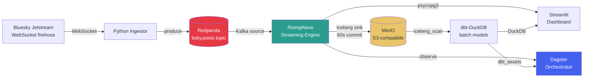

# bluesky-lakehouse

A real-time streaming lakehouse built on the [Bluesky Jetstream](https://github.com/bluesky-social/jetstream) firehose — ingesting live posts, running continuous SQL analytics, storing to Apache Iceberg, and serving a live dashboard.

## Architecture



## Stack

| Layer | Technology |
|---|---|
| Firehose | Bluesky Jetstream (WebSocket) |
| Message broker | Redpanda (Kafka-compatible) |
| Streaming SQL | RisingWave (materialized views, watermarks, Iceberg sink) |
| Object storage | MinIO (S3-compatible, local) |
| Table format | Apache Iceberg + Apache Polaris (REST catalog) |
| Batch transforms | dbt-DuckDB (`iceberg_scan`) |
| Orchestration | Dagster (software-defined assets, hourly schedule) |
| Dashboard | Streamlit (live + historical tabs) |
| Language | Python 3.13, managed with `uv` |

## Quickstart

**Prerequisites:** Docker, Python ≥ 3.11, [`uv`](https://docs.astral.sh/uv/)

```bash
git clone https://github.com/<your-handle>/bluesky-lakehouse
cd bluesky-lakehouse

# 1. Start all services
docker compose up -d

# 2. Install Python deps
uv sync

# 3. Configure Polaris catalog + permissions
bash scripts/setup_polaris.sh
bash scripts/fix_polaris_permissions.sh

# 4. Create Iceberg table
uv run python scripts/create_iceberg_table.py

# 5. Load RisingWave objects (source, MVs, Iceberg sink)
for f in sql/05 sql/02 sql/03 sql/04 sql/06 sql/07 sql/08 sql/09 sql/10; do
    psql -h localhost -p 4566 -d dev -U root -f ${f}_*.sql
done

# 6. Start ingestor (background)
uv run python -m services.ingestion.ingestor &

# 7. Run dbt
cd analytics && DBT_PROFILES_DIR=. uv run dbt deps && DBT_PROFILES_DIR=. uv run dbt run && cd ..

# 8. Start Dagster UI
uv run dagster dev -m orchestration.definitions

# 9. Start dashboard
uv run streamlit run dashboard/app.py
```

Dagster UI: http://localhost:3000  
Dashboard: http://localhost:8501  
MinIO console: http://localhost:9001 (minio / minio123)

## Project Layout

```
bluesky-lakehouse/
├── services/
│   ├── ingestion/          # WebSocket → Redpanda ingestor
│   └── harness/            # Exactly-once verification harness
├── sql/                    # RisingWave DDL (01–10)
├── analytics/              # dbt project (DuckDB + Iceberg)
│   ├── models/
│   │   ├── staging/        # stg_posts (reads Iceberg directly)
│   │   └── marts/          # fct_posts_hourly, dim_languages
├── orchestration/          # Dagster definitions
│   └── assets/             # ingestion / streaming / batch assets
├── dashboard/              # Streamlit app (3 tabs)
├── scripts/                # Setup, measure_lateness, exactly-once experiment
└── docker-compose.yml      # Redpanda, RisingWave, MinIO, Polaris
```

## Key Results

| Metric | Value |
|---|---|
| Event-time latency p50 | ~54 seconds |
| Event-time latency p99 | ~100 seconds |
| Exactly-once delivery | **PASS** — 50,000 / 50,000 markers, 0 duplicates, 0 missing |
| Iceberg sink commit cadence | ~60 seconds |
| Dagster assets | 8 (ingestion: 1, streaming: 5, dbt: 3) |
| dbt models | 3 (stg_posts, fct_posts_hourly, dim_languages) |
| RisingWave MVs | 7 (posts/min, posts/sec, posts_flat, hashtags 5m, hashtags 1h, spike detector, lateness view) |

> Latency is measured event-time to processing-time delta via `event_lateness_hist` view in RisingWave (sql/10 + scripts/measure_lateness.py). The ~54s p50 reflects real-world Jetstream delivery + Kafka round-trip + watermark delay.

## What Was Built (Day by Day)

| Day | What | Key files |
|---|---|---|
| 1 | Project scaffold, Redpanda, firehose smoke tests | `docker-compose.yml`, `services/ingestion/` |
| 2 | Continuous ingestor, MinIO | `services/ingestion/ingestor.py` |
| 3 | RisingWave, first MV | `sql/01–04` |
| 4 | Polaris catalog, Iceberg sink, Parquet landing | `scripts/create_iceberg_table.py`, `sql/04` |
| 5 | Watermarks, streaming SQL depth (7 MVs) | `sql/05–10`, `scripts/measure_lateness.py` |
| 6 | Exactly-once verification harness | `services/harness/`, `scripts/run_exactly_once_experiment.sh` |
| 7 | dbt-DuckDB batch layer | `analytics/` |
| 8 | Dagster orchestration + hourly schedule | `orchestration/` |
| 9 | Streamlit dashboard (live + historical) | `dashboard/app.py` |

## Reading List

- [RisingWave watermark docs](https://docs.risingwave.com/sql/syntax/watermarks)
- [Apache Iceberg spec](https://iceberg.apache.org/spec/)
- [Dagster software-defined assets](https://docs.dagster.io/concepts/assets/software-defined-assets)
- [dbt-duckdb adapter](https://github.com/duckdb/dbt-duckdb)
- [Bluesky Jetstream](https://github.com/bluesky-social/jetstream)
